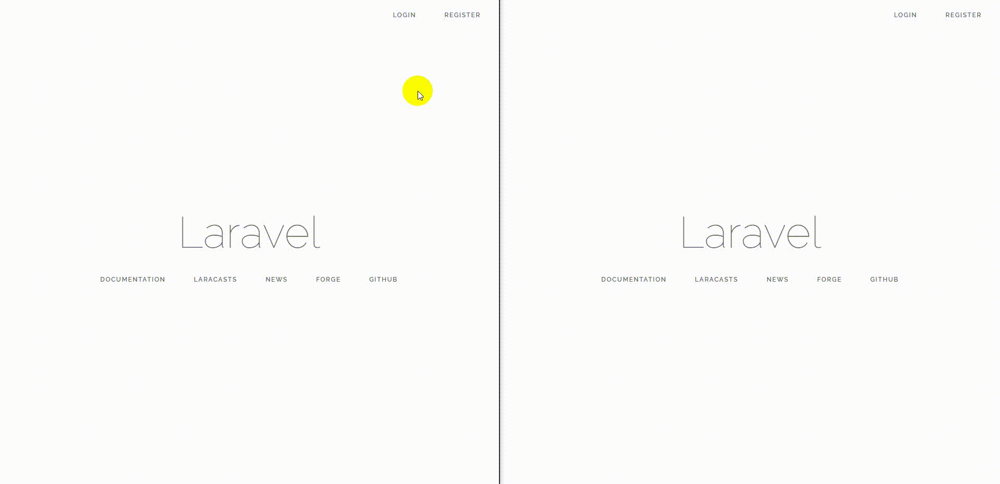
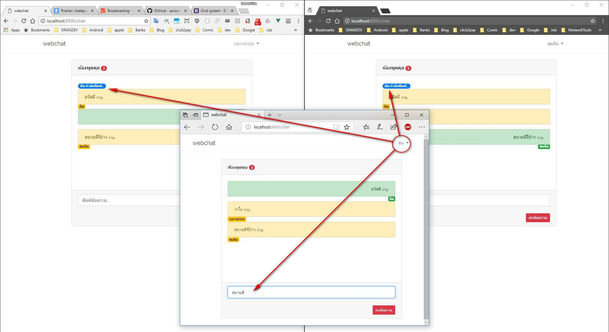

# Laravel 5.6
Real Time Chat With ***Laravel Broadcast, Pusher and Vuejs***

## ขันตอนการติดตั้ง
1. composer install
2. npm install
3. แก้ไขไฟล์ .env (DB, PUSHER)
4. php artisan migrate
5. npm run dev
6. php artisan serv